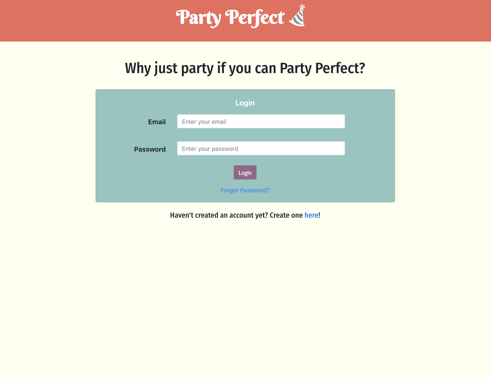

# Party-Perfect

Explore the [Project Page](https://github.com/Perfect-Partiers/Party-Perfect)

View it live on [Heroku](https://party-perfect.herokuapp.com/)

## Table of Contents

- [About The Project](#about-the-project)
  - [Built With](#built-with)
- [Usage](#usage)
  - [Demo](#demo)
- [Future Development](#future-development)
- [Contributing](#contributing)
- [Contact](#contact)

## About The Project

The Pandemic will (eventually) be coming to an end and the birthday bashes, backyard BBQs,

**Login Page**

**Signup Page**

**Members Page**

**Party Detail Page**

### Built With

This project was built using:

- JavaScript
- [React](https://reactjs.org/)
- [React Router](https://reactrouter.com/)
- [Node.js](https://nodejs.org/api/fs.html)
- [Express.js](https://expressjs.com/)
- [dotenv](https://www.npmjs.com/package/dotenv)
- [Nodemon](https://www.npmjs.com/package/nodemon)
- [FullCalendar](https://fullcalendar.io/docs/view-api)
- [Bootstrap](https://getbootstrap.com/)
- [Axios](https://www.npmjs.com/package/axios)
- [Firebase](https://firebase.google.com/)
- [Font Awesome](https://fontawesome.com/)

## Usage

To use this application, the user must login, or if not already a member, create an account. Once logged in, the user will be directed to their own personal member's page, where recipient/gift lists will appear if previously created.

This application can be used throughout the year to keep track of gift recipients and associated gift lists. Recipients and gift lists can be removed as needed.

### Demo

Watch the short video below to see how the application works.

## Future Development

Below is a list of additional features and content the development team would like to add to this project moving forward:

-

## Contributing

Contributions are what make the open source community such an amazing place to learn, inspire, and create. Any contributions you make are **greatly appreciated**.

1. Fork the Project
2. Create your Feature Branch (`git checkout -b feature/AmazingFeature`)
3. Commit your Changes (`git commit -m 'Add some AmazingFeature'`)
4. Push to the Branch (`git push origin feature/AmazingFeature`)
5. Open a Pull Request

## Contact

Project Link: [https://github.com/Perfect-Partiers/Party-Perfect](https://github.com/Perfect-Partiers/Party-Perfect)

Live Link:[https://github.com/TommyWillen/Party-Perfect](https://github.com/TommyWillen/Party-Perfect)
