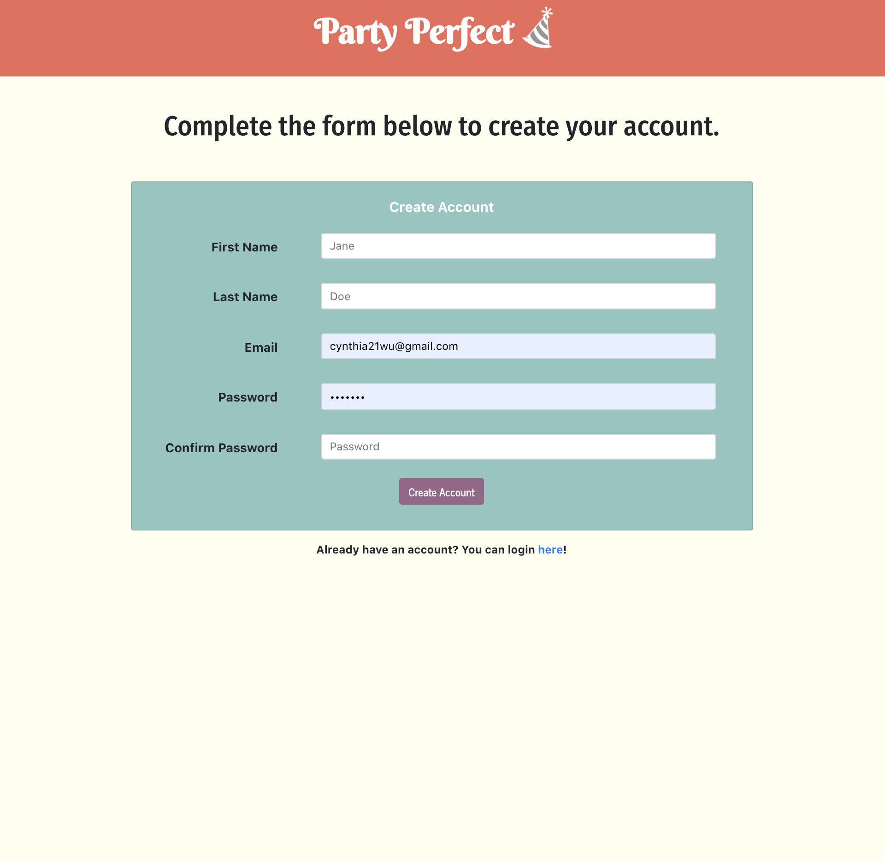
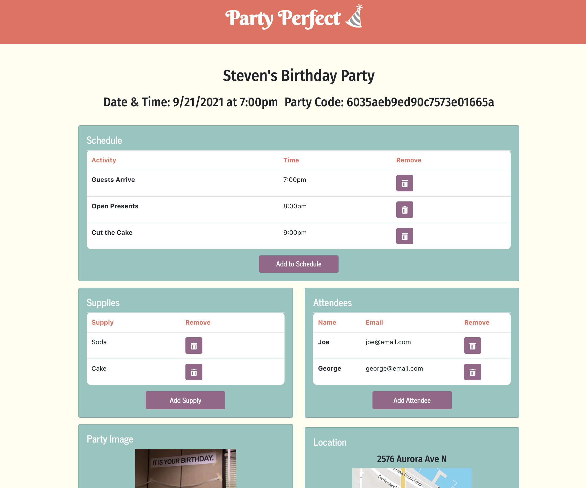

# Party-Perfect

Explore the [Project Page](https://github.com/Perfect-Partiers/Party-Perfect)

View it live on [Heroku](https://party-perfect.herokuapp.com/)

## Table of Contents

- [About The Project](#about-the-project)
  - [Built With](#built-with)
- [Usage](#usage)
  - [Demo](#demo)
- [Future Development](#future-development)
- [Contributing](#contributing)
- [License](#license)
- [Contact](#contact)

## About The Project

The Pandemic will (eventually) come to an end, and the birthday bashes, backyard BBQs, and breathtaking banquets will resume. When this time comes, party planners will need an easy way to keep track of upcoming parties and the details that come along with them. Party Perfect was created to do just that. With this application, the user can add upcoming parties to their home page, and keep track of the party schedule, invited attendees, needed supplies, and can even view past events.

**Login Page**

**Signup Page**

**Member's Page**

**Party Detail Page**

### Built With

This project was built using:

- JavaScript
- [React](https://reactjs.org/)
- [React Router](https://reactrouter.com/)
- [Node.js](https://nodejs.org/api/fs.html)
- [Express.js](https://expressjs.com/)
- [dotenv](https://www.npmjs.com/package/dotenv)
- [Nodemon](https://www.npmjs.com/package/nodemon)
- [FullCalendar](https://fullcalendar.io/docs/view-api)
- [Bootstrap](https://getbootstrap.com/)
- [Axios](https://www.npmjs.com/package/axios)
- [Firebase](https://firebase.google.com/)
- [Font Awesome](https://fontawesome.com/)
- [Cloudinary](https://cloudinary.com/)

## Usage

To use this application, the user must login, or if not already a member, create an account. Once logged in, the user will be directed to their own personal member's page, where previously created parties will appear. Users will also be able to search through their calendar to view upcoming or past parties.

If the user creates a new party, he/she will be click into that party's detail page. From here the user is able to add attendees, supplies, schedule and a party image. Additionally, the party address can be viewed on the party detail page location card.

### Demo

Watch the short video below to see how the application works.

## Future Development

Below is a list of additional features and content the development team would like to add to this project moving forward:

-

## Contributing

Contributions are what make the open source community such an amazing place to learn, inspire, and create. Any contributions you make are **greatly appreciated**.

1. Fork the Project
2. Create your Feature Branch (`git checkout -b feature/AmazingFeature`)
3. Commit your Changes (`git commit -m 'Add some AmazingFeature'`)
4. Push to the Branch (`git push origin feature/AmazingFeature`)
5. Open a Pull Request

## License

This project is licensed under the permissive open source...

## Contact

Project Link: [https://github.com/Perfect-Partiers/Party-Perfect](https://github.com/Perfect-Partiers/Party-Perfect)

Live Link: [https://party-perfect.herokuapp.com/](https://party-perfect.herokuapp.com/)
